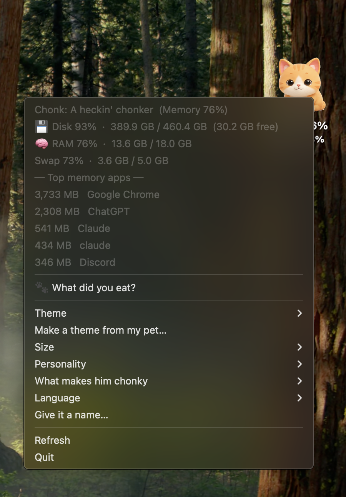
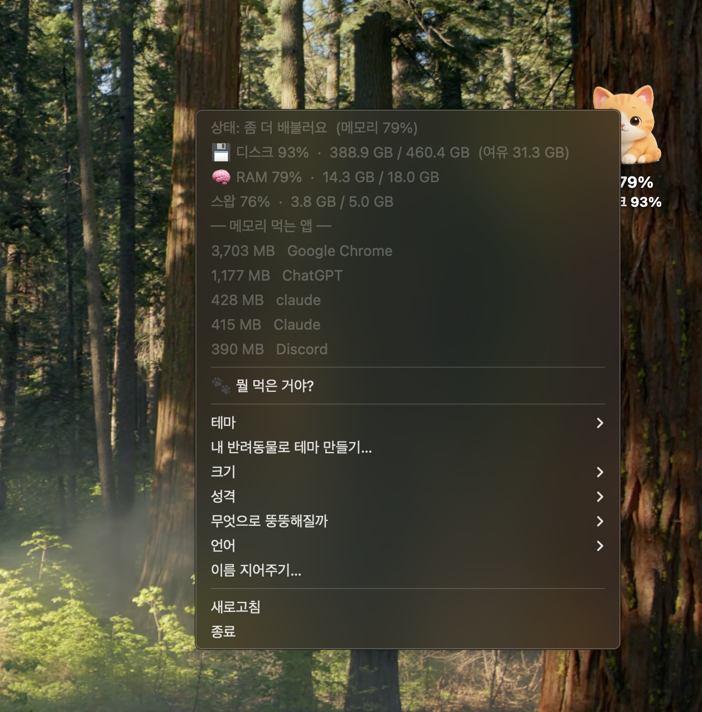
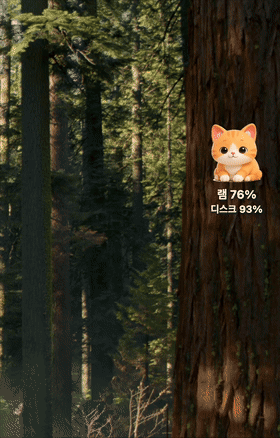
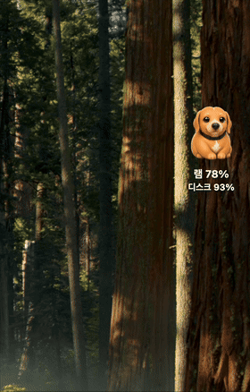
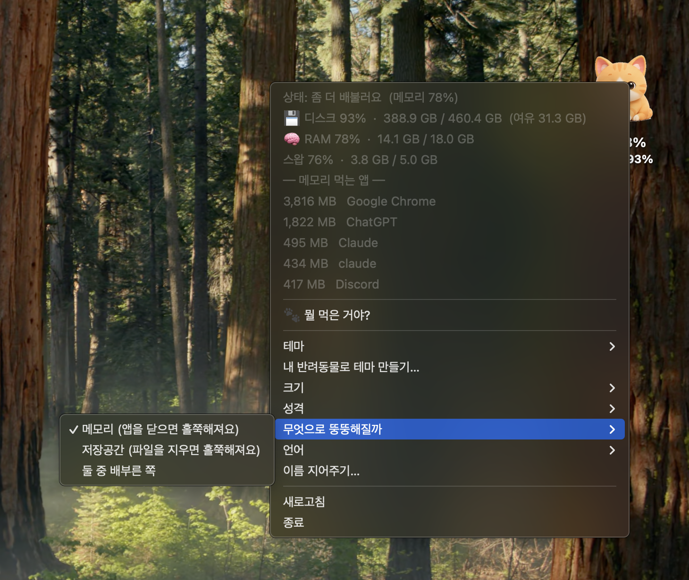
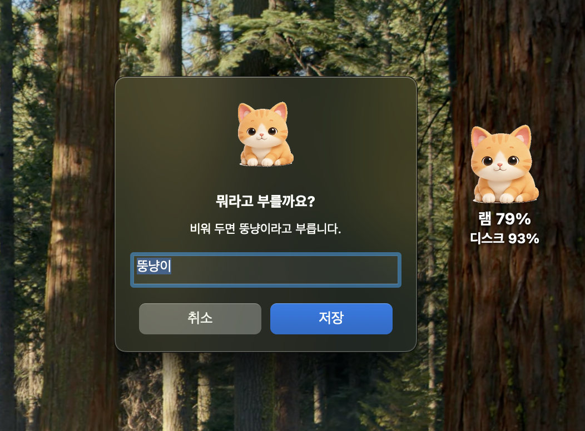
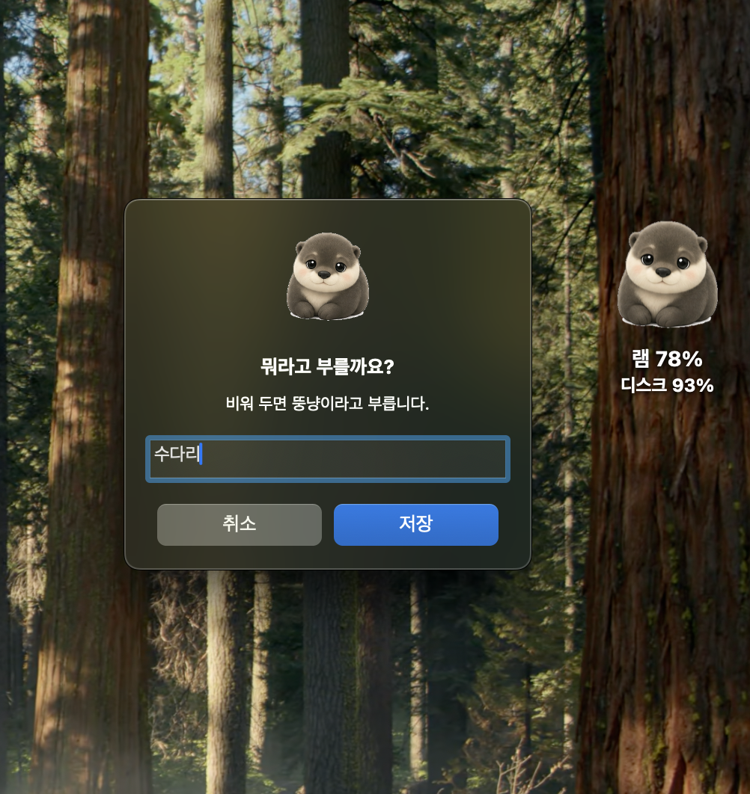
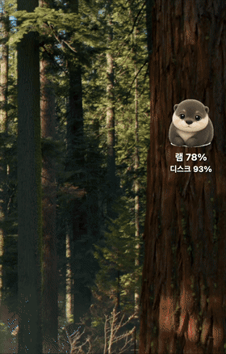

# Memory Cat 🐱

*메모리 뚱냥이 — an OpenAI Build Week project*

> Your memory pressure, visualized as a cat that gets chonkier as your Mac fills up.

<p align="center">
  <a href="https://github.com/hyeonheebee/memory-cat/releases/latest"></a>
  
  
  
</p>

<p align="center">
  
</p>

Memory Cat is a desktop pet for macOS, with a lightweight Windows version. It
turns an invisible system metric into something you can understand at a glance:
the fuller your Mac's memory gets, the rounder your cat becomes.

The killer demo feature makes that cat personal. Give Memory Cat one photo of
your pet, and **gpt-image-2** creates a six-stage chonk progression that the app
automatically converts into a custom desktop theme with six chonk stages.

<a id="screenshots"></a>

## Screenshots · 스크린샷

<table>
  <tr>
    <td align="center">
      <br>
      <sub>The pet gets rounder as memory fills up.<br>메모리가 차오를수록 펫이 더 통통해집니다.</sub>
    </td>
    <td align="center">
      <br>
      <sub>Built-in themes give each chonk a different style<br>기본 제공 테마마다 서로 다른 스타일의 통통한 캐릭터를 보여줍니다.</sub>
    </td>
  </tr>
  <tr>
    <td align="center">
      <br>
      <sub>Memory Cat's menu in English.<br>Memory Cat의 영어 메뉴입니다.</sub>
    </td>
    <td align="center">
      <br>
      <sub>Memory Cat's menu in Korean.<br>Memory Cat의 한국어 메뉴입니다.</sub>
    </td>
  </tr>
  <tr>
    <td align="center" colspan="2">
      <sub>The chonk stage, disk, RAM, swap, top memory apps, the diagnosis, themes, personality, and language — all on right-click<br>통통 단계, 디스크, RAM, 스왑, 메모리를 많이 사용하는 앱, 진단, 테마, 성격, 언어를 모두 우클릭 메뉴에서 확인할 수 있습니다.</sub>
    </td>
  </tr>
</table>

<table>
  <tr>
    <td align="center" valign="top">
      <br>
      <sub>Memory Cat on the desktop<br>데스크톱에서 실행 중인 Memory Cat입니다.</sub>
    </td>
    <td align="center" valign="top">
      <br>
      <sub>GPT-5.6 diagnosis result<br>GPT-5.6이 분석한 컴퓨터 상태와 조언입니다.</sub>
    </td>
  </tr>
  <tr>
    <td align="center" valign="top">
      <br>
      <sub>Pet photo to chonk sprite sheet<br>반려동물 사진 한 장으로 통통해지는 단계별 이미지를 만듭니다.</sub>
    </td>
    <td align="center" valign="top">
      <br>
      <sub>Safe cleanup confirmation<br>정리할 항목을 확인하고 휴지통으로 이동합니다.</sub>
    </td>
  </tr>
</table>

<a id="live-changes-and-personalization"></a>

### Live changes and personalization · 실시간 변화모습과 개인 커스텀 옵션

<table>
  <tr>
    <td align="center">
      <br>
      <sub>This is Cute, one of the four built-in themes. It gets rounder as memory fills up.<br>이건 기본 제공 네 가지 테마 중 하나인 Cute입니다. 메모리가 차오를수록 더 통통해집니다.</sub>
    </td>
    <td align="center">
      <br>
      <sub>A custom pet theme in action.<br>커스텀 반려동물 테마가 작동하는 모습입니다.</sub>
    </td>
  </tr>
</table>

<p align="center">
  <br>
  <sub>Choosing memory, storage, or whichever is fuller<br>메모리, 저장공간, 둘 중 사용률이 높은 쪽에서 크기 변화 기준을 선택합니다.</sub>
</p>

<a id="highlights"></a>

## Highlights · 핵심 기능

- **One pet photo → one custom animated theme:** gpt-image-2 preserves your
  pet's distinctive colors, markings, face, and ears while generating a
  six-stage horizontal sprite sheet. Memory Cat segments it and builds the
  theme automatically.<br>
  **사진 한 장 → 나만의 애니메이션 테마:** 반려동물 사진 한 장으로 고유한 특징을 살린 6단계 이미지를 생성하고,
  앱이 이를 자동으로 데스크톱 테마로 변환합니다.

- **The complete chonk chart:** **A fine boi → He chomnk → A heckin' chonker →
  HEFTYCHONK → MEGACHONKER → OH LAWD HE COMIN**. Everyday use keeps him in the
  middle of the chart; the last two names are for a Mac that is genuinely out of
  room, so seeing one means something. Korean has its own six — see
  [Where he changes shape](#where-he-changes-shape).<br>
  **통통해지는 6단계:** 사용량에 따라 여섯 단계로 모습과 이름이 바뀝니다.
  일상적인 사용은 중간 단계에 해당하며, 마지막 두 단계는 높은 사용량을
  나타냅니다. 한국어에도 별도의 여섯 단계 이름이 있습니다.

- **“🐾 What did you eat?” diagnosis:** GPT-5.6 (`gpt-5.6-luna`) explains why the
  computer feels slow, recommends safe cleanup targets, estimates reclaimable
  space, and gives one concise piece of advice. The Korean menu label is
  “🐾 뭘 먹은 거야?”.<br>
  **“🐾 뭘 먹은 거야?” 상태 진단:** 컴퓨터가 느려진 이유를 설명하고, 안전한 용량 정리 대상과 예상 확보 공간을
  알려주며 한 줄 조언을 제공합니다.

- **Safety-first cleanup:** only allowlisted browser caches, Trash contents,
  downloads older than 30 days, and Xcode DerivedData can be suggested. Every
  item requires confirmation and is moved through macOS Trash—never permanently
  deleted.<br>
  **안전한 용량 정리:** 허용 목록에 있는 항목만 정리 대상으로 제안하며, 각 항목은 사용자 확인 후
  macOS 휴지통으로 이동합니다. 영구 삭제하지 않습니다.

- **A cat with a personality:** choose a sassy, warm, or stoic voice, or describe
  a custom personality in natural language. The selected voice shapes the
  diagnosis.<br>
  **성격 있는 고양이:** 까칠한 말투, 따뜻한 말투, 담담한 말투를 고르거나
  원하는 성격을 직접 설명할 수 있습니다. 선택한 성격은 진단의 말투에 반영됩니다.

- **English and Korean:** macOS language is detected automatically, with a
  manual language override in the context menu.<br>
  **영어·한국어 지원:** macOS의 언어를 자동으로 감지하며, 우클릭 메뉴에서
  언어를 직접 바꿀 수도 있습니다.

- **Useful at a glance:** disk, RAM, swap, and top memory-consuming apps appear
  in the right-click menu. The cat can be dragged, resized, and rethemed.<br>
  **시스템 상태를 한눈에:** 우클릭 메뉴에서 디스크, RAM, 스왑, 메모리를 많이 사용하는 앱을 확인하고,
  고양이를 이동하거나 크기와 테마를 바꿀 수 있습니다.

- **Make it yours:** name the pet from the context menu and use a generated
  theme such as an otter. For example, a generated theme may be stored under
  an automatically assigned folder such as `mypet9`, while its display name can
  be a name you choose, such as `수다리`.<br>
  **나만의 반려동물로 꾸미기:** 우클릭 메뉴에서 반려동물의 이름을 정하고 수달과 같은 생성 테마를 사용할
  수 있습니다. 예를 들어 테마는 `mypet9`와 같은 자동 지정 폴더에 저장될 수
  있고, 표시 이름은 `수다리`처럼 직접 정할 수 있습니다.

The AI-powered items above are macOS only. See
[Install on Windows](#install-on-windows) for what the Windows build covers.

<a id="what-makes-him-chonky"></a>

## What makes him chonky · 무엇을 기준으로 통통해질까요?

By default the cat follows **memory** — close a few apps and he slims down
within seconds. Right-click → **What makes him chonky** to switch:

| Choice | He slims down when you… |
|---|---|
| **Memory** (default) | close apps |
| **Storage** | delete files |
| **Whichever is fuller** | do either |

Memory is the default because that is usually what makes a Mac feel slow —
when RAM runs out, macOS pushes pages to swap and pulls them back, and you feel
the wait. Storage matters too: a full drive leaves swap no room to grow.

> Swap usage is deliberately **not** part of the score. macOS creates and
> removes swap files on demand, so `used / total` mostly measures how big the
> kernel decided to make the file — the denominator moves with the numerator,
> and the ratio swings without your Mac's pressure changing. It can even move
> the wrong way: when pressure rises and the kernel grows the swap file, the
> ratio falls. Counting it made the cat slim down after a reboot while the Mac
> was actually more pressured than before. The diagnosis still reports swap; it
> just does not decide his size.

<a id="where-he-changes-shape"></a>

### Where he changes shape · 모습이 바뀌는 기준

He changes shape at the same points his name changes, in both languages, so the
picture and the label never disagree.

| Usage | English | 한국어 |
|---|---|---|
| under 60% | A fine boi | 아직 더 먹을 수 있어요 |
| 60% | He chomnk | 살짝 배불러요 |
| 70% | A heckin' chonker | 좀 더 배불러요 |
| 80% | HEFTYCHONK | 이제 진짜 배불러요 |
| 90% | MEGACHONKER | 슬슬 잠이 와요 |
| 96% | OH LAWD HE COMIN | 졸려요 |

A running Mac never empties its memory — mine sits between 61% and 80% — so
mapping 0–100% straight onto the six pictures would have used only two of them.
Each band gets its own picture instead. Inside a band the movement is linear, so
themes that really are forty separate drawings, like *Wake-up call*, still
animate smoothly.

The Windows build follows storage only.<br>
Windows 버전은 저장공간 사용량만을 기준으로 크기가 변합니다.

<a id="give-your-pet-a-name"></a>

## Give your pet a name · 반려동물 이름 짓기

On macOS, right-click the pet and choose **Give it a name…**. Leave the field
empty to use the default name, or enter a name such as `수다리`.<br>
macOS에서 반려동물을 우클릭하고 <strong>이름 지어주기…</strong>를 선택하세요. 입력란을
비워두면 기본 이름을 사용하고, `수다리`와 같은 이름을 입력할 수 있습니다.

For example, a generated theme may be stored under an automatically assigned
folder such as `mypet9`, while its display name can be a name you choose, such
as `수다리`.<br>
예를 들어, 생성된 테마는 `mypet9`와 같이 자동으로 지정된 폴더에 저장될 수
있고, 표시 이름은 `수다리`처럼 사용자가 직접 정할 수 있습니다.

New themes generated from the menu are applied immediately. They are stored
under the next available `mypet`, `mypet2`, … name so an existing theme is not
overwritten, and they can be selected again from the **Theme** menu later.<br>
메뉴에서 생성한 새 테마는 바로 적용됩니다. 기존 테마를 덮어쓰지 않도록
다음으로 사용 가능한 `mypet`, `mypet2` 등의 이름으로 저장되며, 나중에
**테마** 메뉴에서 다시 선택할 수 있습니다.

<table>
  <tr>
    <td align="center">
      <br>
      <sub>Choosing a display name for the pet<br>반려동물의 이름을 직접 정할 수 있습니다.</sub>
    </td>
    <td align="center">
      <br>
      <sub>One example of a custom pet display name: 수다리<br>직접 정한 반려동물 이름의 예시: 수다리</sub>
    </td>
  </tr>
  <tr>
    <td align="center" colspan="2">
      <br>
      <sub>A custom pet theme in action. One example of a custom pet display name: 수다리.<br>커스텀 반려동물 테마가 작동하는 모습입니다. 커스텀 반려동물 표시 이름의 한 예는 수다리입니다.</sub>
    </td>
  </tr>
</table>

<a id="privacy"></a>

## Privacy · 개인정보 보호

Memory Cat does not phone home. Disk, RAM, and swap numbers are measured and
drawn entirely on your machine, and nothing is collected or sent anywhere in
the background. There is no analytics, telemetry, or crash reporting in the
codebase. (The macOS installer does route the app's own stdout and stderr to a
local `cat.log` under `~/Library/Logs/Memory Cat/`, which never leaves your
machine.)

Two features reach the network, and only when you click them yourself:

- **🐾 What did you eat? diagnosis** sends the usage numbers, the names of the apps
  using the most memory, and per-category cleanup totals. If you wrote your own
  personality description, that text is sent as well, since it shapes the reply.
  **File names and paths are never sent** — the payload is assembled without
  them, and a test enforces it. The request also sets `store=False`.
- **Make a theme from my pet…** uploads the photo you pick. A consent dialog
  naming OpenAI appears first, and nothing is uploaded until you approve it.

Both features need your own `OPENAI_API_KEY`. **Without a key the app still
works**: the diagnosis falls back to a local, rules-based explanation and only
custom theme generation is unavailable. See
[Turning on AI features](#turning-on-ai-features) to add one.<br>
두 기능 모두 본인의 `OPENAI_API_KEY`가 필요합니다. **키가 없어도 앱은 정상적으로
동작합니다.** 진단은 기기 안에서 규칙 기반 설명으로 대신하고, 커스텀 테마 만들기만
쓸 수 없습니다. 키를 넣는 방법은 [AI 기능 켜기](#turning-on-ai-features)를 참고하세요.

Cleanup can only ever touch four allowlisted locations — browser caches, the
Trash, downloads older than 30 days, and Xcode DerivedData. That list is fixed
in code and the model cannot extend it. Every item is confirmed individually
with its full path shown, and items are moved to the macOS Trash rather than
deleted.

<a id="runtime-models"></a>

## Runtime models · 사용하는 AI 모델

- Performance diagnosis: **GPT-5.6** (`gpt-5.6-luna`)
- Custom pet theme generation: **gpt-image-2**

<a id="built-in-themes"></a>

## Built-in themes · 기본 제공 테마

| Theme | Description |
|---|---|
| Cute | A soft 3D-toy cat whose eyes get sleepier as it gets rounder |
| Simple | A clean, minimal illustrated chonk |
| Madness | A sparkly, wide-eyed chibi cat |
| Wake-up call | An intentionally derpy reminder to check your drive |

<a id="download"></a>

## Download · 다운로드

Prebuilt builds live on the [releases page](https://github.com/hyeonheebee/memory-cat/releases/latest).
Nothing to install — unzip it, drag `Memory Cat.app` into your **Applications**
folder, and open it.

| | File | Notes |
|---|---|---|
| macOS (Apple Silicon) | `Memory-Cat-macOS-AppleSilicon.zip` | macOS 11 or later |
| macOS (Intel) | `Memory-Cat-macOS-Intel.zip` | macOS 10.13 or later |
| Windows | `MemoryCat.exe` | x64. No AI features — and no network requests at all |

Prefer to build it yourself, or want it to start automatically at login?
Use [Install on macOS](#install-on-macos) below instead.

<a id="macos-will-refuse-to-open-it-the-first-time"></a>

### macOS will refuse to open it the first time · macOS에서 첫 실행이 차단될 때

These builds are **not code-signed** — I have no Apple Developer certificate.
macOS therefore cannot verify them and blocks the first launch. The app is fine;
macOS just has no way to know that. Verify the SHA-256 in the release notes if
you want to be sure you got the file I published.

**On macOS 15 (Sequoia) and later**, the dialog offers only *Done* and *Move to
Trash* — right-clicking and choosing *Open* no longer works. Do this instead:

1. Double-click the app once and press **Done** on the warning.
2. Open **System Settings → Privacy & Security**, scroll to the bottom.
3. Next to *"Memory Cat" was blocked*, press **Open Anyway**.

That entry only appears right after a blocked launch, so do step 1 first.

**On macOS 11–14**, right-click the app and choose **Open**, then **Open** again
in the dialog.

You only have to do this once.

<a id="starting-it-at-login"></a>

### Starting it at login · 로그인 시 자동 실행

A downloaded build does not register a login item by itself. Open Memory Cat
once, then switch it on in **System Settings → General → Login Items &
Extensions**. ([Install on macOS](#install-on-macos) below sets this up for you
instead.)

<a id="turning-on-ai-features"></a>

### Turning on AI features · AI 기능 켜기

Memory Cat works without an API key. The cat still watches your disk and
memory, and **🐾 What did you eat?** gives a local, rules-based explanation.
Add your own OpenAI API key to turn on the features below.<br>
API 키가 없어도 뚱냥이는 정상적으로 동작합니다. 디스크와 메모리도 계속 보고,
<strong>🐾 뭘 먹은 거야?</strong>는 기기 안에서 규칙 기반으로 설명해 줍니다. 본인 OpenAI API
키를 넣으면 아래 기능이 켜집니다.

- **🐾 What did you eat?** diagnosis with GPT-5.6<br>
  GPT-5.6으로 하는 **🐾 뭘 먹은 거야?** 진단
- **Make a theme from my pet…**<br>
  **내 반려동물로 테마 만들기…**

These are **macOS only**. The Windows build has no AI features.<br>
**macOS 전용**입니다. Windows 버전에는 AI 기능이 없습니다.

**The key is yours, and so is the bill.** Requests are charged to your own
OpenAI account. Create a key at
[platform.openai.com/api-keys](https://platform.openai.com/api-keys).<br>
**키도 요금도 본인 계정입니다.** 사용한 만큼 본인 OpenAI 계정에 청구됩니다. 키는
[platform.openai.com/api-keys](https://platform.openai.com/api-keys)에서 만들 수 있습니다.

**1. Create the key file and open it.** Paste these three lines into Terminal.<br>
**1. 키 파일을 만들고 엽니다.** 터미널에 아래 세 줄을 붙여 넣으세요.

```bash
mkdir -p "$HOME/Library/Application Support/Memory Cat"
touch "$HOME/Library/Application Support/Memory Cat/.env"
open -e "$HOME/Library/Application Support/Memory Cat/.env"
```

TextEdit opens an empty file. (Why not a one-line `echo`? That would leave your
key in your shell history.)<br>
텍스트 편집기에 빈 파일이 열립니다. (`echo` 한 줄로 넣지 않는 이유: 키가 터미널
기록에 남습니다.)

**2. Paste one line, then save with ⌘S.**<br>
**2. 아래 한 줄을 붙여 넣고 ⌘S로 저장합니다.**

```
OPENAI_API_KEY=sk-...
```

Replace `sk-...` with your key. **Don't add quotes.** TextEdit can turn `"` into
curly quotes, and the app then reads them as part of the key.<br>
`sk-...` 자리에 본인 키를 넣으세요. **따옴표는 쓰지 마세요.** 텍스트 편집기가 `"`를
둥근 따옴표로 바꾸면, 앱이 그 따옴표까지 키로 읽습니다.

**3. Restart Memory Cat.** Right-click the cat → **Quit**, then open the app
again.<br>
**3. 뚱냥이를 다시 켭니다.** 고양이를 우클릭 → **종료**한 뒤 앱을 다시 여세요.

**Check that it worked:** right-click → **Make a theme from my pet…**. If a
photo picker opens, the key was found.<br>
**잘 됐는지 확인:** 우클릭 → <strong>내 반려동물로 테마 만들기…</strong>를 눌러 사진 고르는 창이
뜨면 키를 찾은 것입니다.

| You see · 이런 창이 뜨면 | Likely cause · 원인 |
| --- | --- |
| *An API key is needed*<br>*API 키가 필요해요* | The file isn't named exactly `.env`, or it is in a different folder<br>파일 이름이 정확히 `.env`가 아니거나, 다른 폴더에 있습니다 |
| *Couldn't make the theme*<br>*테마를 만들지 못했어요* | The key was found but doesn't work: quotes, a typo, or no credit on the account<br>키는 찾았지만 작동하지 않습니다: 따옴표, 오타, 계정 크레딧 부족 |
| You changed the key and nothing changed<br>키를 바꿨는데 그대로입니다 | Quit and reopen. A running app keeps the old key<br>종료 후 다시 켜세요. 켜져 있는 앱은 예전 키를 계속 씁니다 |

<a id="removing-a-downloaded-build"></a>

### Removing a downloaded build · 다운로드한 앱 삭제

Move the app to the Trash. Your settings and any themes you made stay in
`~/Library/Application Support/Memory Cat/` — delete that folder too if you want
them gone. (If you switched the login item on in System Settings, switch it off
there as well. The `uninstall_mac.command` mentioned below is only for installs
made by `install_mac.command`.)

<a id="install-on-macos"></a>

## Install on macOS · macOS 설치

This path builds the app from source on your own machine and sets it to start
at login. It also works on Intel Macs and does not trip the warning above.

```bash
git clone https://github.com/hyeonheebee/memory-cat.git
cd memory-cat
./install_mac.command        # You can also double-click this file
```

The installer requires Python 3.9 or later. It builds a real application
bundle at `~/Applications/Memory Cat.app`, installs the dependencies into a
virtual environment inside that bundle, launches Memory Cat, and configures it
to start at login.

Because everything the app needs lives in the bundle, **you can delete the
cloned repository afterwards** and Memory Cat keeps working.

On a Mac that has never had developer tools installed, `python3` is only a stub
that prompts you to install them. Run `xcode-select --install` first, then run
the installer again. The installer checks for this and tells you what to do.

<a id="where-your-files-live"></a>

### Where your files live · 파일 저장 위치

| What | Where |
| --- | --- |
| The app | `~/Applications/Memory Cat.app` |
| Settings (`config.json`) | `~/Library/Application Support/Memory Cat/` |
| Themes you generated | `~/Library/Application Support/Memory Cat/frames/` |
| `OPENAI_API_KEY` (`.env`) | `~/Library/Application Support/Memory Cat/` |
| Log | `~/Library/Logs/Memory Cat/cat.log` |
| Login item | `~/Library/LaunchAgents/com.memorycat.desktop.plist` |

The four built-in themes ship inside the bundle and are replaced on every
install. Anything you made stays in Application Support and is never
overwritten.

**Upgrading from an older install?** The installer copies your existing
`config.json`, `.env`, and any custom `frames/<name>/` folders out of the
repository and into Application Support on first run. It copies rather than
moves, so the originals in your clone are left untouched, and it never
overwrites a file that is already there.

<a id="removing-it"></a>

### Removing it · 앱 삭제

```bash
./uninstall_mac.command
```

If you already deleted the repository, the same script is kept inside the app:

```bash
"$HOME/Applications/Memory Cat.app/Contents/Resources/uninstall_mac.command"
```

Either way it stops the app, removes the login item and the bundle, and leaves
your settings and custom themes alone. It prints the one command that deletes
those too, if that is what you want.

<a id="updating"></a>

### Updating · 업데이트

Pull, then run `./install_mac.command` again. It stops the running app,
rebuilds the bundle, and restarts it.

To enable GPT-5.6 diagnosis and custom pet themes, see
[Turning on AI features](#turning-on-ai-features). When you run from a clone
for development, a `.env` in the project root still works.<br>
GPT-5.6 진단과 커스텀 반려동물 테마를 켜려면 [AI 기능 켜기](#turning-on-ai-features)를
참고하세요. 개발용으로 저장소를 복제해서 실행할 때는 프로젝트 루트의 `.env`도 그대로
쓸 수 있습니다.

<a id="install-on-windows"></a>

## Install on Windows · Windows 설치

> **What the Windows build includes.** The disk-driven cat, RAM and swap
> readouts, top memory consumers, theme and size switching, and the Korean /
> English language toggle. The AI features are macOS only: the 🐾 What did you
> eat? diagnosis, custom pet themes, safe cleanup, and personalities. In
> exchange the Windows build has no OpenAI dependency and makes no network
> requests at all.
>
> **Windows 버전에 포함된 기능.** 디스크 사용량을 기준으로 변하는 고양이,
> RAM·스왑 정보, 메모리를 많이 사용하는 앱 목록, 테마 및 크기 전환,
> 한국어·영어 언어 전환을 제공합니다. 🐾 뭘 먹은 거야? 진단, 커스텀
> 반려동물 테마, 안전한 용량 정리, 성격 기능은 macOS 전용입니다. 대신 Windows
> 버전은 OpenAI 의존성이 없고 네트워크 요청도 전혀 하지 않습니다.
>
> *Features planned (diagnosis and custom themes)*<br>
> *기능 추가 예정 (진단 및 커스텀 테마)*

See [`windows/README.txt`](windows/README.txt) for the full instructions. In
short:

```bat
pip install -r windows\requirements.txt
pythonw windows\windows_cat.pyw
```

To build a standalone executable, install PyInstaller and run `build_exe.bat`.
It works from any working directory — the script switches to its own folder
before building, so `windows\build_exe.bat` from the repository root is fine:

```bat
pip install -r windows\requirements.txt
pip install pyinstaller
windows\build_exe.bat
```

In PowerShell, prefix the script with `.\` — PowerShell does not run commands
from the current directory otherwise, and reports the script as an unrecognized
term:

```powershell
.\windows\build_exe.bat
```

> **The executable it produces is unsigned — expect security warnings.** This is
> a personal project with no code-signing certificate, so the first launch of
> `MemoryCat.exe` triggers a Windows SmartScreen "unknown publisher" prompt, and
> antivirus engines sometimes flag PyInstaller `--onefile` builds as a false
> positive (a `--onefile` binary unpacks itself into a temp folder at startup,
> which resembles malware behaviour). That is expected here, but **please do not
> learn to click through unsigned-binary warnings in general** — it is a
> genuinely dangerous habit. Do not run a `MemoryCat.exe` that reached you by
> any other route — a forwarded file, a mirror, a chat attachment — because
> there is no way to tell it was built from this repository.
>
> The build on this repository's [releases page](https://github.com/hyeonheebee/memory-cat/releases/latest)
> is the one exception, and only if you check it: each release note publishes
> the SHA-256 of the file, so compare it before running.
>
> ```powershell
> Get-FileHash .\MemoryCat.exe -Algorithm SHA256
> ```
>
> If you would rather not trust any binary, skip the executable and run the
> Python script directly: `windows/windows_cat.pyw` is a single readable file
> you can inspect before running it. Building the `.exe` yourself, on your own
> machine, is always the safest option.

<a id="make-your-own-theme-"></a>

## Make your own theme 🎨 · 나만의 테마 만들기

<a id="from-one-pet-photo-with-gpt-image-2"></a>

### From one pet photo with gpt-image-2 · gpt-image-2로 반려동물 사진으로 테마 만들기

On macOS, right-click the cat and choose **Make a theme from my pet…**. After
you select a photo and approve sending it to OpenAI, the app generates, imports,
and immediately applies the new theme in a background thread.

The same pipeline is available from the command line:

```bash
# install_mac.command builds its virtual environment inside the app bundle.
# For a development environment in the clone, make your own:
python3 -m venv .venv
./.venv/bin/python -m pip install --upgrade pip   # stock pip cannot resolve pyobjc-core
./.venv/bin/python -m pip install -r requirements.txt

# Keep OPENAI_API_KEY in the project root .env file
./.venv/bin/python vision_theme.py my-pet.jpg my-pet --quality medium
```

`vision_theme.py` asks gpt-image-2 for six clearly separated versions of the
same pet, from slim to extremely round. It then reuses the existing import
pipeline to write those six stages out as `cat_00.png` through `cat_39.png`
under
`~/Library/Application Support/Memory Cat/frames/my-pet/`, plus preview and raw
debug images. Set `MEMORY_CAT_HOME` to write somewhere else.

<a id="from-an-existing-sprite-sheet"></a>

### From an existing sprite sheet · 기존 스프라이트 시트에서 테마 만들기

If you already have a horizontal image with multiple stages from slim to round,
import it directly:

```bash
./.venv/bin/python import_theme.py my-sprite-sheet.png my-theme
```

Themes are discovered automatically from two places: the four built-in themes
inside the app bundle, and your own themes in
`~/Library/Application Support/Memory Cat/frames/<name>/`. Newly generated
themes always go to the second one, so reinstalling the app never deletes them.
Reopen the right-click **Theme** menu to select a newly imported theme. Themes
generated from the menu use automatic folder names (`mypet`, `mypet2`, …);
the pet's display name is set separately through **Give it a name…**.
Code-generated built-in themes can be rebuilt with `python generate_frames.py`.

<a id="project-structure"></a>

## Project structure · 프로젝트 구조

```text
desktop_cat.py      macOS desktop app and menus (PyObjC)
apppaths.py         where bundled assets end and user data begins
macos/build_app.py  assembles Memory Cat.app and the LaunchAgent plist
                    (local install; the bundle it makes needs the Python it
                    was built with)
macos/memorycat.spec  PyInstaller spec for the release zips (self-contained:
                    Python and every dependency live inside the bundle)
brain.py            GPT-5.6 performance diagnosis and safe Trash workflow
personality.py      personality presets and custom prompt compiler
i18n.py             English/Korean UI strings and chonk-stage names
metrics.py          shared disk and memory measurements
vision_theme.py     one pet photo -> gpt-image-2 custom theme
import_theme.py     sprite sheet segmentation and frame generation
generate_frames.py  built-in theme generator
windows/            lightweight Windows app (PySide6)
frames/<theme>/     generated PNG frames for each theme
tests/              mocked, regression, and optional live API tests
```

<a id="developer-demo-and-test-overrides"></a>

## Developer demo and test overrides · 개발자용 데모·테스트 설정

- `MEMORY_CAT_CONFIG=demo_config.json`: use a separate config file for demos or
  tests so personal settings are not read or modified.
- `MEMORY_CAT_DEMO_DISK_PERCENT=92`: replace measured disk usage with a demo or
  test value, clamped to 0–100; displayed and diagnostic values stay consistent.
- `MEMORY_CAT_HOME=/tmp/cat-home`: relocate everything under
  `~/Library/Application Support/Memory Cat/` — settings, custom themes, and
  `.env` — so a test run cannot touch your real data.
- `MEMORY_CAT_APPS_DIR=/tmp/apps`: install the bundle somewhere other than
  `~/Applications`. Used by `install_mac.command` and `uninstall_mac.command`.

Example:

```bash
MEMORY_CAT_CONFIG=demo_config.json \
MEMORY_CAT_DEMO_DISK_PERCENT=92 \
.venv/bin/python desktop_cat.py
```

<a id="how-i-collaborated-with-codex"></a>

## How I collaborated with Codex · Codex와 협업한 방법

All application code in this project was written by **Codex** (GPT-5.6-Codex) in a
single continuous session in the ChatGPT desktop app, working directly on this
repository. My workflow for every feature:

1. **Spec first** — I wrote a detailed spec for each module (goals, design
   decisions, safety constraints, test requirements, done criteria) and handed
   it to Codex as one prompt.
2. **Codex implements** — Codex wrote the code, tests, and commits: the GPT-5.6
   diagnosis engine (`brain.py`), the safety-first trash pipeline (`safe_trash`
   with an allowlist + macOS Trash only), i18n, the personality system, and the
   killer feature — `vision_theme.py`, which turns one photo of your pet into a
   six-stage chonk-progression theme via gpt-image-2.
3. **Verify against the real API** — mocked tests all passed, but my review
   partner (Claude, which I used for planning, code review, and demo prep —
   never for the code itself) ran a live API call and caught a real bug:
   gpt-image-2 rejects the `response_format` parameter. I reported it back to
   Codex with the error, Codex verified it against the API reference and shipped
   the fix with a regression test (`assertNotIn("response_format", kwargs)`).

Models used at runtime: **GPT-5.6** (`gpt-5.6-luna`) powers the cat's
personality-driven performance diagnosis; **gpt-image-2** generates the custom
pet sprite sheets.

<a id="author-and-license"></a>

## Author and license · 제작자와 라이선스

Built by Hyeonhee Shim (@hyeonheebee). Code by Codex; planning, review, and demo by Claude. MIT License.

The MIT License covers the code. The name **"Memory Cat" / "메모리 뚱냥이"** and
the cat artwork are not part of that grant — if you redistribute a modified
version, please give it a different name.

The Windows build bundles **PySide6**, which is licensed under the LGPL. Its
source and build script are in [`windows/`](windows/), and the release
executable is built from them by [GitHub Actions](.github/workflows/build-windows.yml),
so you can rebuild it yourself with a modified PySide6 if you wish.
