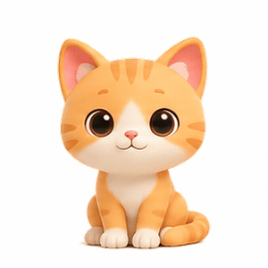
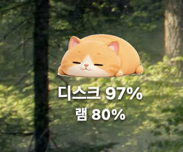
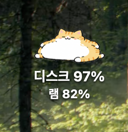
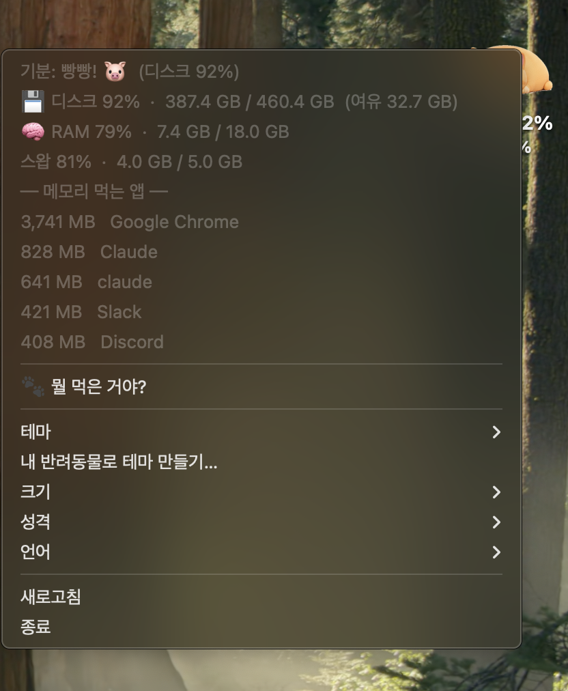
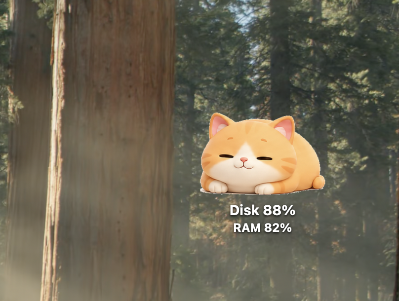
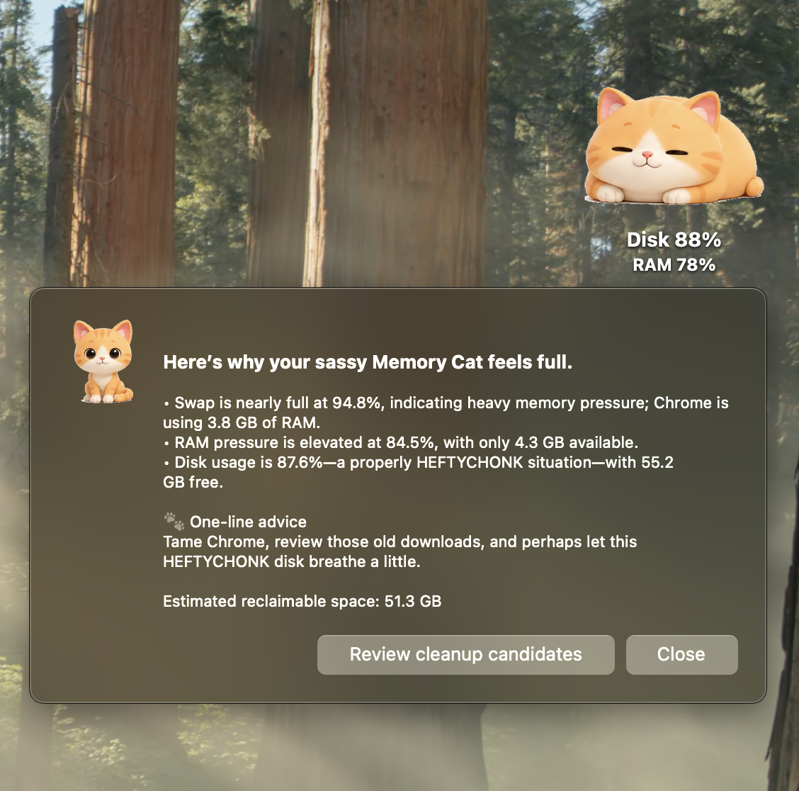
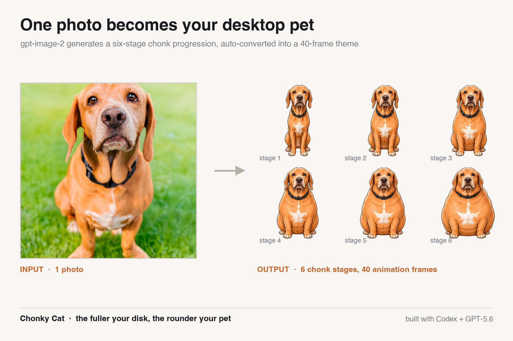
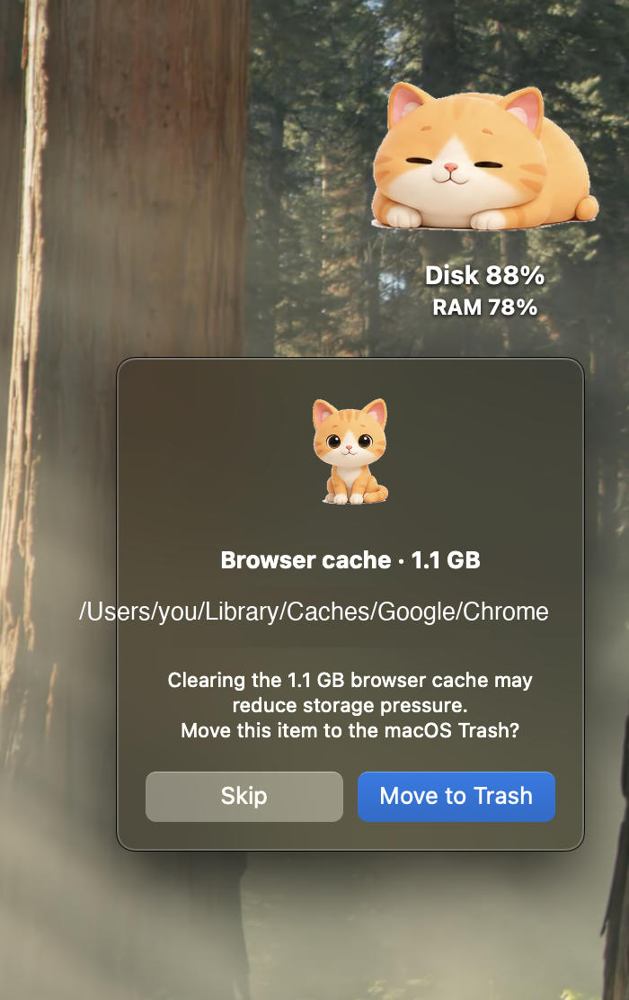

# Memory Cat 🐱

*메모리 뚱냥이 — an OpenAI Build Week project*

> Your disk usage, visualized as a cat that gets chonkier as your drive fills up.

<p align="center">
  
</p>

Memory Cat is a desktop pet for macOS, with a lightweight Windows version. It
turns an invisible system metric into something you can understand at a glance:
the fuller your drive gets, the rounder your cat becomes.

The killer demo feature makes that cat personal. Give Memory Cat one photo of
your pet, and **gpt-image-2** creates a six-stage chonk progression that the app
automatically converts into a custom 40-frame desktop theme.

## Screenshots

<table>
  <tr>
    <td align="center">
      <br>
      <sub>The default cat gets rounder as disk usage rises</sub>
    </td>
    <td align="center">
      <br>
      <sub>Built-in themes give each chonk a different style</sub>
    </td>
  </tr>
  <tr>
    <td align="center" colspan="2">
      <br>
      <sub>The chonk stage, disk, RAM, swap, top memory apps, the diagnosis, themes, personality, and language — all on right-click</sub>
    </td>
  </tr>
</table>

<p align="center">
  
  
  
  
</p>

## Highlights

- **One pet photo → one custom animated theme:** gpt-image-2 preserves your
  pet's distinctive colors, markings, face, and ears while generating a
  six-stage horizontal sprite sheet. Memory Cat segments it and builds the full
  40-frame theme automatically.
- **The complete chonk chart:** disk usage moves your cat through **A fine boi →
  He chomnk → A heckin' chonker → HEFTYCHONK → MEGACHONKER → OH LAWD HE
  COMIN**.
- **“🐾 What did you eat?” diagnosis:** GPT-5.6 (`gpt-5.6-luna`) explains why the
  computer feels slow, recommends safe cleanup targets, estimates reclaimable
  space, and gives one concise piece of advice. The Korean menu label is
  “🐾 뭘 먹은 거야?”.
- **Safety-first cleanup:** only allowlisted browser caches, Trash contents,
  downloads older than 30 days, and Xcode DerivedData can be suggested. Every
  item requires confirmation and is moved through macOS Trash—never permanently
  deleted.
- **A cat with a personality:** choose a sassy, warm, or stoic voice, or describe
  a custom personality in natural language. The selected voice shapes the
  diagnosis.
- **English and Korean:** macOS language is detected automatically, with a
  manual language override in the context menu.
- **Useful at a glance:** disk, RAM, swap, and top memory-consuming apps appear
  in the right-click menu. The cat can be dragged, resized, and rethemed.

The AI-powered items above are macOS only. See
[Install on Windows](#install-on-windows) for what the Windows build covers.

## Privacy

Memory Cat does not phone home. Disk, RAM, and swap numbers are measured and
drawn entirely on your machine, and nothing is collected or sent anywhere in
the background. There is no analytics, telemetry, or crash reporting in the
codebase. (The macOS installer does route the app's own stdout and stderr to a
local `cat.log` beside the app, which never leaves your machine.)

Two features reach the network, and only when you click them yourself:

- **🐾 What did you eat? diagnosis** sends the usage numbers, the names of the apps
  using the most memory, and per-category cleanup totals. If you wrote your own
  personality description, that text is sent as well, since it shapes the reply.
  **File names and paths are never sent** — the payload is assembled without
  them, and a test enforces it. The request also sets `store=False`.
- **Make a theme from my pet…** uploads the photo you pick. A consent dialog
  naming OpenAI appears first, and nothing is uploaded until you approve it.

Both features need your own `OPENAI_API_KEY`. **Without a key the app still
works**: the diagnosis falls back to a local, rules-based explanation and only
custom theme generation is unavailable.

Cleanup can only ever touch four allowlisted locations — browser caches, the
Trash, downloads older than 30 days, and Xcode DerivedData. That list is fixed
in code and the model cannot extend it. Every item is confirmed individually
with its full path shown, and items are moved to the macOS Trash rather than
deleted.

## Runtime models

- Performance diagnosis: **GPT-5.6** (`gpt-5.6-luna`)
- Custom pet theme generation: **gpt-image-2**

## Built-in themes

| Theme | Description |
|---|---|
| Cute | A soft 3D-toy cat whose eyes get sleepier as it gets rounder |
| Simple | A clean, minimal illustrated chonk |
| Madness | A sparkly, wide-eyed chibi cat |
| Wake-up call | An intentionally derpy reminder to check your drive |

## Install on macOS

```bash
git clone https://github.com/hyeonheebee/memory-cat.git
cd memory-cat
./install_mac.command        # You can also double-click this file
```

The installer requires Python 3.9 or later. It creates `.venv`, installs the
dependencies, launches Memory Cat, and configures it to start at login.

On a Mac that has never had developer tools installed, `python3` is only a stub
that prompts you to install them. Run `xcode-select --install` first, then run
the installer again. The installer checks for this and tells you what to do.

To remove it, run:

```bash
./uninstall_mac.command
```

After pulling a new version, restart the app so the updated code is loaded —
a running instance keeps the modules it imported at launch:

```bash
pkill -f desktop_cat.py && ./.venv/bin/python desktop_cat.py &
```

Store `OPENAI_API_KEY` in a `.env` file at the project root to enable GPT-5.6
diagnosis and custom pet theme generation.

## Install on Windows

> **What the Windows build includes.** The disk-driven cat, RAM and swap
> readouts, top memory consumers, and theme and size switching. The AI features
> are macOS only: the 🐾 What did you eat? diagnosis, custom pet themes, safe
> cleanup, personalities, and the language toggle. In exchange the Windows
> build has no OpenAI dependency and makes no network requests at all.

See [`windows/README.txt`](windows/README.txt) for the full instructions. In
short:

```bat
pip install pyside6 psutil
pythonw windows\windows_cat.pyw
```

To build a standalone executable, run `build_exe.bat` **from inside the
`windows` folder** (it resolves `frames` and the script by relative path), after
installing its listed build dependencies.

## Make your own theme 🎨

### From one pet photo with gpt-image-2

On macOS, right-click the cat and choose **Make a theme from my pet…**. After
you select a photo and approve sending it to OpenAI, the app generates, imports,
and immediately applies the new theme in a background thread.

The same pipeline is available from the command line:

```bash
# The image-processing dependencies ship with requirements.txt, which
# install_mac.command already installs. For a manual virtual environment:
./.venv/bin/python -m pip install -r requirements.txt

# Keep OPENAI_API_KEY in the project root .env file
./.venv/bin/python vision_theme.py my-pet.jpg my-pet --quality medium
```

`vision_theme.py` asks gpt-image-2 for six clearly separated versions of the
same pet, from slim to extremely round. It then reuses the existing import
pipeline to produce `frames/my-pet/cat_00.png` through `cat_39.png`, plus preview
and raw debug images.

### From an existing sprite sheet

If you already have a horizontal image with multiple stages from slim to round,
import it directly:

```bash
./.venv/bin/python import_theme.py my-sprite-sheet.png my-theme
```

Themes under `frames/<name>/` are discovered automatically. Reopen the
right-click **Theme** menu to select a newly imported theme. Code-generated
built-in themes can be rebuilt with `python generate_frames.py`.

## Project structure

```text
desktop_cat.py      macOS desktop app and menus (PyObjC)
brain.py            GPT-5.6 performance diagnosis and safe Trash workflow
personality.py      personality presets and custom prompt compiler
i18n.py             English/Korean UI strings and chonk-stage names
metrics.py          shared disk and memory measurements
vision_theme.py     one pet photo -> gpt-image-2 custom theme
import_theme.py     sprite sheet segmentation and frame generation
generate_frames.py  built-in theme generator
windows/            lightweight Windows app (PySide6)
frames/<theme>/     generated PNG frames for each theme
tests/              mocked, regression, and optional live API tests
```

## Developer demo and test overrides

- `MEMORY_CAT_CONFIG=demo_config.json`: use a separate config file for demos or
  tests so personal settings are not read or modified.
- `MEMORY_CAT_DEMO_DISK_PERCENT=92`: replace measured disk usage with a demo or
  test value, clamped to 0–100; displayed and diagnostic values stay consistent.

Example:

```bash
MEMORY_CAT_CONFIG=demo_config.json \
MEMORY_CAT_DEMO_DISK_PERCENT=92 \
.venv/bin/python desktop_cat.py
```

## How I collaborated with Codex

All application code in this project was written by **Codex** (GPT-5.6-Codex) in a
single continuous session in the ChatGPT desktop app, working directly on this
repository. My workflow for every feature:

1. **Spec first** — I wrote a detailed spec for each module (goals, design
   decisions, safety constraints, test requirements, done criteria) and handed
   it to Codex as one prompt.
2. **Codex implements** — Codex wrote the code, tests, and commits: the GPT-5.6
   diagnosis engine (`brain.py`), the safety-first trash pipeline (`safe_trash`
   with an allowlist + macOS Trash only), i18n, the personality system, and the
   killer feature — `vision_theme.py`, which turns one photo of your pet into a
   40-frame chonk-progression theme via gpt-image-2.
3. **Verify against the real API** — mocked tests all passed, but my review
   partner (Claude, which I used for planning, code review, and demo prep —
   never for the code itself) ran a live API call and caught a real bug:
   gpt-image-2 rejects the `response_format` parameter. I reported it back to
   Codex with the error, Codex verified it against the API reference and shipped
   the fix with a regression test (`assertNotIn("response_format", kwargs)`).

Models used at runtime: **GPT-5.6** (`gpt-5.6-luna`) powers the cat's
personality-driven performance diagnosis; **gpt-image-2** generates the custom
pet sprite sheets.

## Author and license

Built by Hyeonhee Shim (@hyeonheebee). Code by Codex; planning, review, and demo by Claude. MIT License.
